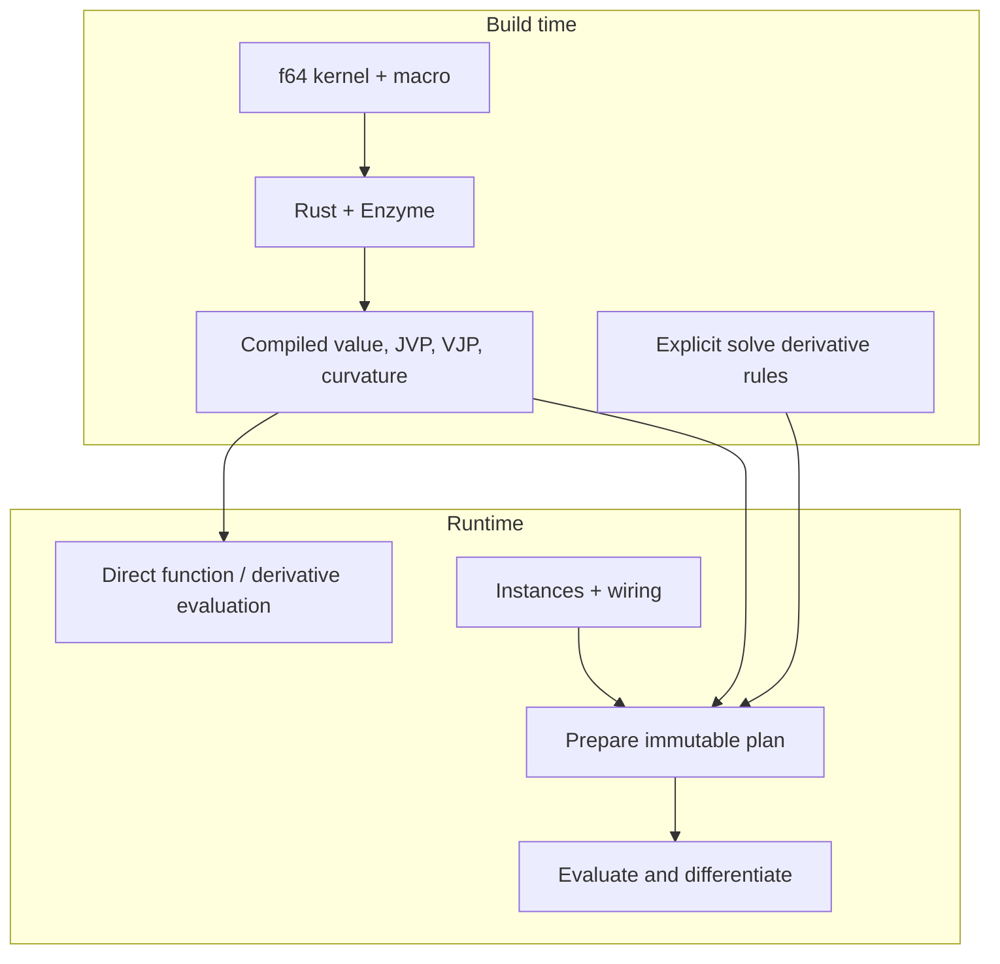
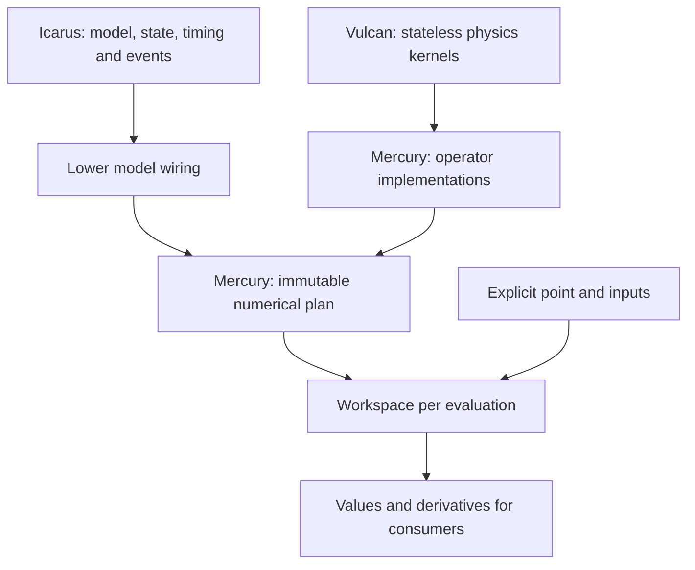
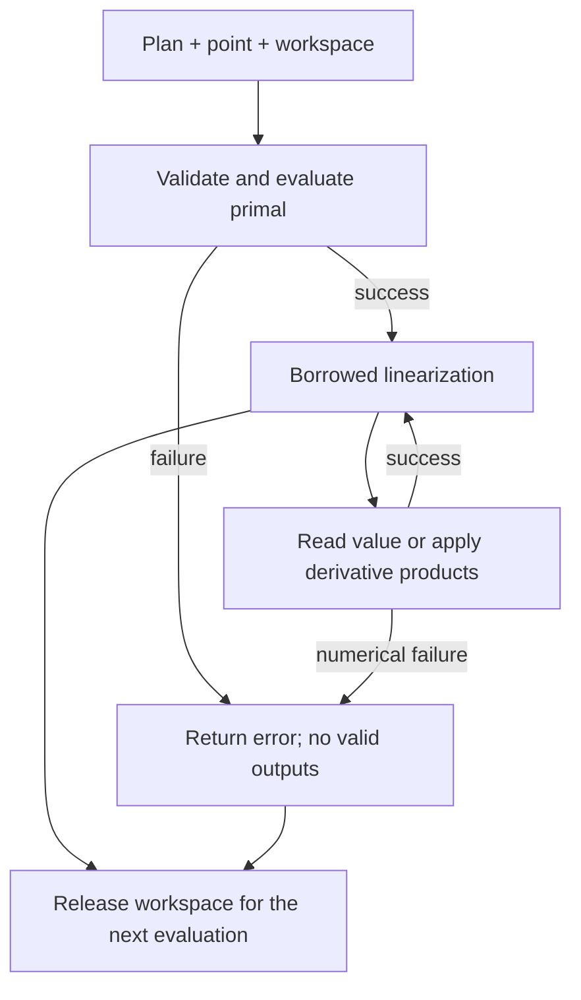
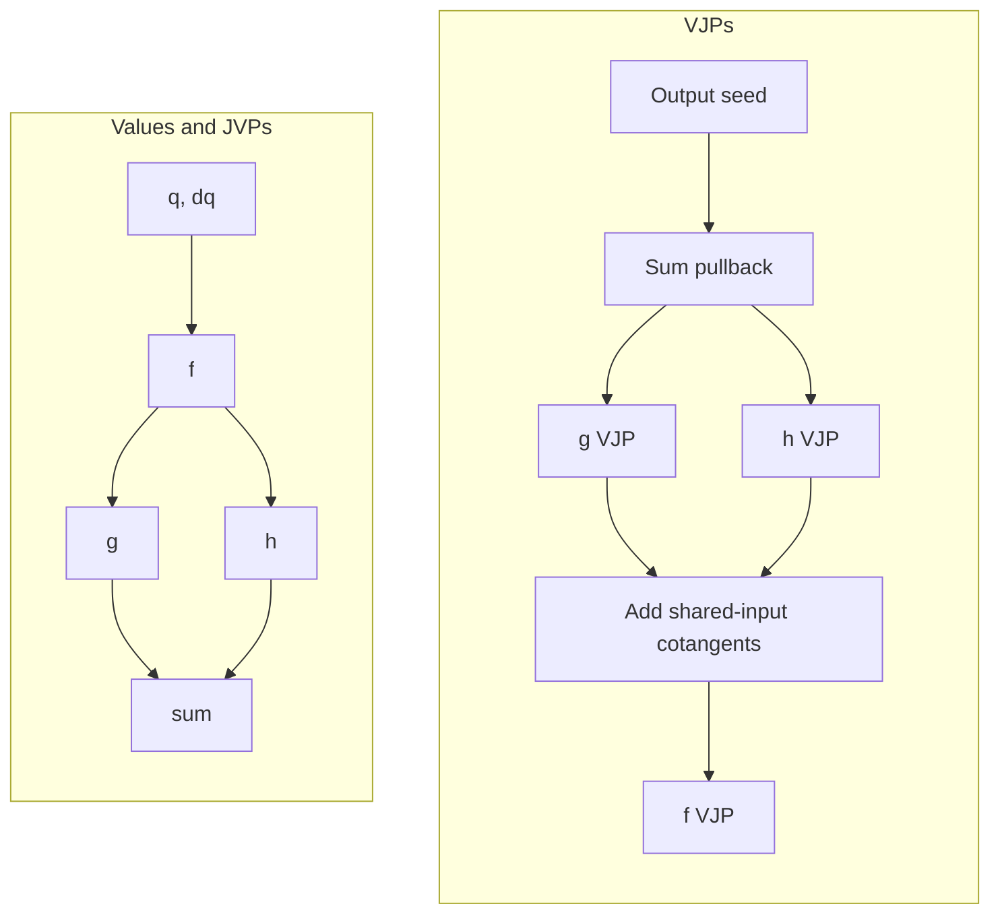
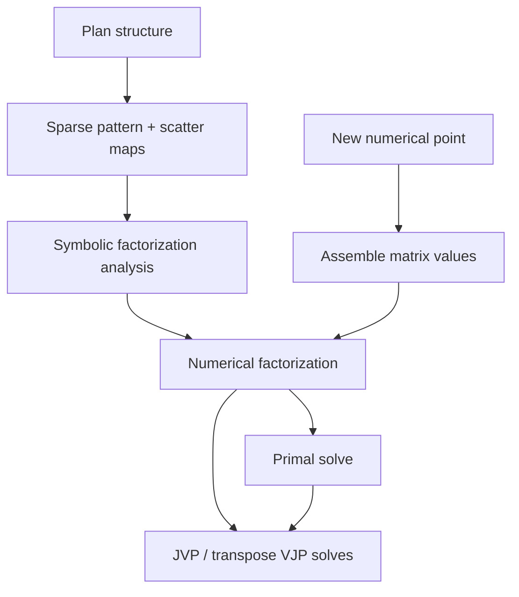
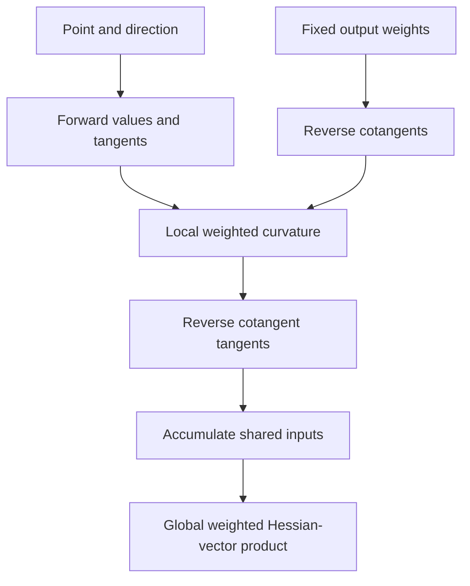
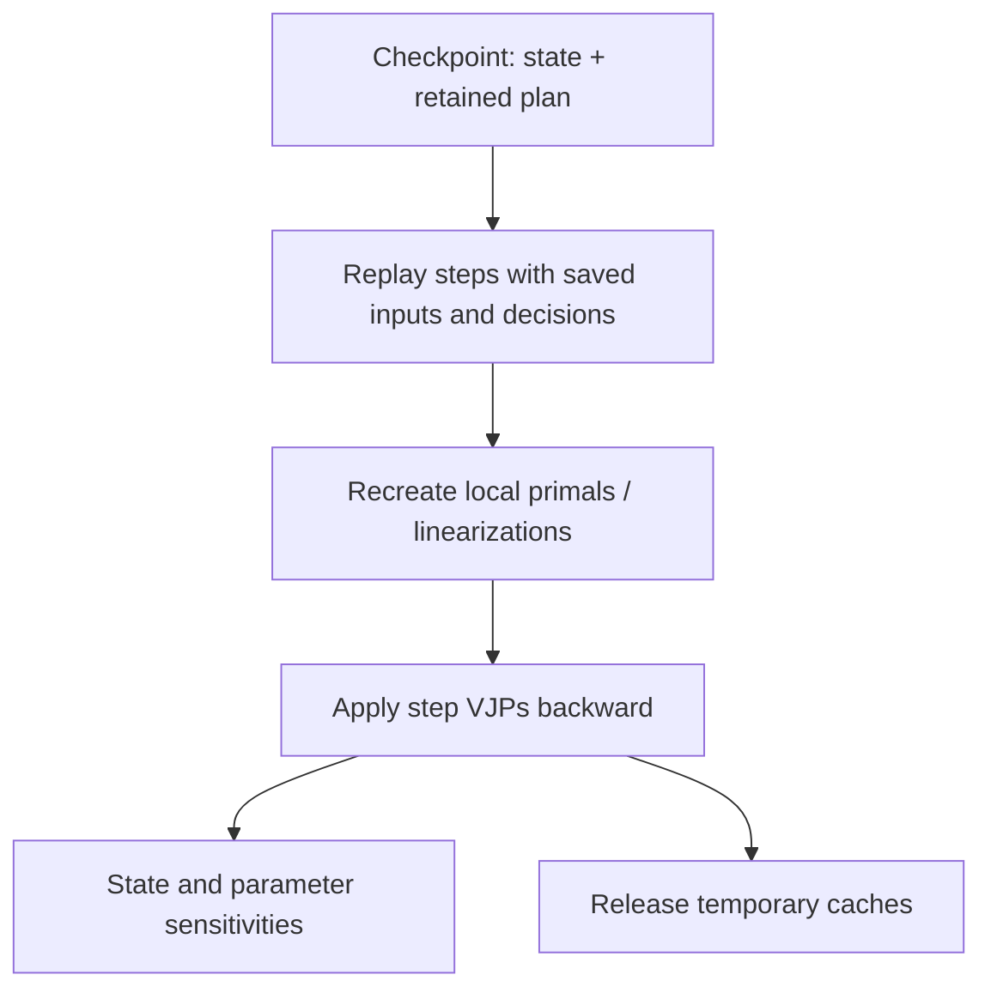

# Mercury architecture

Mercury composes differentiable numerical operators for simulation and
optimization. Compiled kernels, runtime plans, dense and sparse Jacobians,
second-order products, and linear/implicit solves are implemented. This design
supersedes the matrix/primitive implementation at `58d2f49`.

## Compile kernels, compose operators

Start with `#[function(Name)]` on an ordinary Rust function with scalar, vector, or matrix arguments.
Its named type exposes checked `eval` and scalar `gradient` or vector `jacobian`
calls, returning owned values. The same type implements `Operator` for plans.
See [API examples](api.md) for supported signatures and call costs. Plan values,
gradients and Jacobians use the same simple names. Explicit execution and
operator-authoring contracts live in [advanced](advanced.md).



Kernels compute `y = f(q, c)` with ordinary `f64` arithmetic, arrays and slices.
The compiled signature fixes activity: put potentially differentiated values
in `q`; put dimensions, indices and deliberately inactive configuration in
`c`. Runtime seeds select directions within `q`. Zero-seeding an input
excludes its contribution to a JVP; it cannot make a `Const` input active.
Macros generate Enzyme entry points and buffer adapters from the kernel.
`#[differentiable(inputs = n, outputs = m)]` accepts a concrete function with
signature `fn(config: &Config, q: &[f64], y: &mut [f64])` and generates its
`<name>_operator(config)` constructor. Domain validators run in the adapter.

Use substantial numerical blocks with stable interfaces. Keep helper calls and
domain algorithms, including tree traversal over inactive indices, inside a
kernel. Keep I/O, global mutation and Mercury's scheduler outside it. Measure
dispatch and data movement before splitting or fusing blocks.

Runtime wiring can rearrange compiled operators. New kernel implementations
require compilation. A symbolic expression builder/JIT, generic scalar system,
and general-purpose Mercury matrix library are outside the initial scope.

## Ownership



Icarus owns the simulation model and lowers it into a Mercury plan; it does not
maintain a separately editable copy of that plan's connections. Generic Mercury
consumers can build plans directly. One plan drives value and derivative
execution; Mercury does not schedule simulation activations or commit state.
A plan also implements `Operator`, allowing nested numerical groups and
runtime-composed residuals inside an implicit solve.

| Object | Owns or borrows |
| --- | --- |
| Operator | Numerical implementation, dimensions, derivative capabilities and dependency contract |
| Plan | Operator instances, inactive configuration, connections, execution order and structural layouts |
| Workspace | Mutable values, derivative buffers, scratch and numerical caches |
| Linearization | Immutable borrows of one point and plan, plus exclusive access to its workspace |

Graph/configuration edits produce a new plan epoch, published between
evaluations or accepted steps. Validate all submitted dimensions and cycles before publication, then prune
unreachable nodes and compact their storage. A retained node executes all of its outputs.
Never change topology during a derivative sweep or nonlinear solve.

## Evaluation and linearization



`evaluate` computes values without preparing derivative caches. `linearize`
validates and evaluates a point before returning a borrowed linearization.
Its value and derivative products refer to that same point and plan. Drop it
before changing either or reusing its workspace. Concurrent evaluations need
separate workspaces.

Preparation promises consistent mathematics, not one total primal execution.
Derivative calls may recompute kernels or use cached local Jacobians/factors.
There is no assumed reusable Enzyme tape.

The host boundary returns `Result`. Initial numerical kernels are infallible
on their documented domains; adapters check dimensions, aliasing, domain
preconditions and finite results, and propagate solver errors. Argument errors
are rejected before execution. A numerical failure invalidates the evaluation,
its outputs and caches; further products require fresh preparation. Partially
written buffers are never valid results.

## Derivative products

First-order operators provide both JVP and VJP, with scalar and batch forms.
For `f: R^n -> R^m`, batches store each direction contiguously:

| Operation | Seed layout | Result layout |
| --- | --- | --- |
| JVP | `k × n` | `k × m` |
| VJP | `k × m` | `k × n` |

Both layouts are flat, row-major buffers with no padding. Scalar forms use
`k = 1`. A zero batch accepts empty buffers and performs no derivative work.
Validate dimensions and size arithmetic before dispatch. Preserve caller
inputs/seeds and overwrite results; a batch is valid only after full success.

A scalar loop is the baseline. Optimized adapters can process compiled-width
chunks and scalar tails without changing semantics. The pinned compiler has
passed width-four forward and reverse probes; some other activity/shape
combinations fail. See [validation](validation.md#isolated-probes-2026-09-12).
Choose direction and width using required products, sparsity and measurements.
A VJP through a vector-output block needs one seed, not a full Jacobian.



The plan propagates tangents in topological order and cotangents in reverse
order. Shared inputs, repeated connections and fan-out require explicit,
ordered accumulation. Reuse local scratch; direct writes to unique destinations
may avoid copies. This contract does not require allocation per edge.

## Jacobians and solves

Assemble dense or CSC Jacobians from colored forward products or uncolored reverse rows
when needed. Dependencies propagate through the plan, so graph adjacency is not the
global sparsity pattern. Conservative patterns cover every branch allowed by an epoch; a
numerical zero does not remove an entry.

faer is the sole general linear algebra dependency. Use its matrices, views
and factorizations. Keep shape, stride and
packing conversions at the boundary; owned faer matrices may contain padding.
Faer internals remain outside Enzyme unless a particular path is validated.



The plan lazily builds conservative dependencies and a CSC pattern with deterministic
column coloring on structural inspection or assembly. Value and derivative products do
not prepare these caches. Columns sharing a residual row receive different colors.
Assembly chooses reverse rows when fewer products are needed; otherwise a JVP seeds all
columns of one color; each stored entry reads its row's result. Dense assembly uses the
same values and fills structural zeros. No dense global Jacobian is needed for sparse
assembly. Kernel dependencies default to dense; Enzyme does not supply expression-level
sparsity. False dependency declarations are trusted mathematical contracts, never
inferred from sampled zeros.

Sparse solve operators and symbolic factorization caches remain future work. Consumers
can reuse faer's symbolic analysis while the pattern is unchanged; reuse numerical
factors only while matrix values are unchanged. Materialize Jacobians when assembly or
repeated products justify their cost; direct products do not require them.

Solve operators expose explicit mathematical rules. For a nonsingular real
system `A x = b`:

```text
JVP:  A dx = db - dA x
VJP:  Aᵀ λ = x_bar;  b_bar = λ;  A_bar = -λ xᵀ
```

Reuse primal factors. `DenseSolve::solve_with_report` optionally measures backward error
and reciprocal condition; ordinary plan solves do not pay that diagnostic cost. For
sparse inputs, form cotangents only for represented entries. For a converged root `R(z,
q) = 0`:

```text
JVP:  R_z dz = -R_q dq
VJP:  R_zᵀ λ = z_bar;  q_bar = -R_qᵀ λ
```

Implicit rules require a differentiable local solution and invertible relevant Jacobian.
Evaluate residual derivatives at the returned solution; rebuild factors left over from
an earlier iterate. Convergence and conditioning affect accuracy. These rules
differentiate the solution, not a finite iteration sequence. Only `R_z` is materialized;
parameter products use the accepted residual workspace directly. Diagnostics and scaled
stopping rules are specified in the API guide. `ImplicitSolve` uses undamped Newton with
an explicit initial guess, a tolerance on scaled residual and Newton-correction norms,
and iteration limit. Mercury composes solve callbacks explicitly; Enzyme does not
substitute them inside arbitrary kernels.

## Second-order composition

The extra local rule is the weighted Hessian-vector product `D(J(q)^T w)[v]`, holding
output weights `w` constant. Typed function macros compile it with Enzyme
forward-over-reverse unless `first_order` is selected. Advanced slice kernels can attach
a callback; absent rules return `UnsupportedDerivative`.

`gradient()` and `jacobian()` handles are operators. Their first products use
the original operator's curvature. Their own curvature is unsupported because
it would require third derivatives. Plan handles share immutable structure and
keep workspaces separate; no derivative handle retains mutable evaluation state.

`gradient().jacobian().eval(...)` computes a scalar Hessian. Matrix-free consumers
use the advanced weighted curvature product.



For each node, differentiated reverse accumulation is
`d_input_bar = J^T d_output_bar + H(output_bar) input_tangent`.
This includes cross-node terms; a collection of local Hessians alone does not.

For `A x = b`, reuse the prepared factors:

```text
A dx = db - dA x
Aᵀ λ = w
Aᵀ dλ = -dAᵀ λ
H(w) v = [ -dλ xᵀ - λ dxᵀ, dλ ]
```

For `R(z,q) = 0`, retain the residual's accepted-point linearization:

```text
R_z dz = -R_q dq
R_zᵀ λ = w
c = Hessian(λᵀ R) [dz, dq]
R_zᵀ dλ = -c_z
H(w) dq = -c_q - R_qᵀ dλ
```

These rules differentiate the local solution, including matrix and residual variation,
without differentiating factorization code or Newton iterations. Local solve and plan
curvature scratch belongs to the evaluation workspace. First-use growth and
callback/factorization allocation remain possible; this is not an allocation-bound
guarantee.

## Simulation and replay

Icarus lowers three connection meanings:

- Same-evaluation values follow an acyclic dependency schedule.
- Held/delayed values read explicit committed state, unchanged during an
  evaluation. Their sensitivities propagate through state updates across steps.
- Declared implicit groups become residual-solve operators. Condensing them
  must leave an acyclic schedule; unexplained cycles are errors.

An RHS derivative describes `f(t, x, u, p)`. A step derivative describes the
actual numerical update, including integration stages and state mappings.
RHS evaluations do not commit state or draw fresh randomness.



Trajectory adjoints require reproducible step inputs, held state, modes and
event decisions. Keep those explicit so a future checkpoint policy can trade
storage for replay; retaining every operator tape is not required. Choose that
policy from measured memory use. Icarus owns trajectory history; Mercury owns
numerical replay of each prepared plan. History must retain or reconstruct each
immutable plan and its configuration; an epoch number alone is insufficient.
The trajectory regression fixture demonstrates a fixed checkpoint stride in host code;
Mercury does not choose a trajectory storage policy.

First and second derivatives apply within fixed modes and specified event
schedules. Every participating operator needs the corresponding rule. Third
derivatives are unsupported; missing curvature rules produce an explicit error.
State-triggered event sensitivities require explicit event-time/reset rules.
The impact example composes a selected transverse event root and reset using existing
operators; it does not implement a general event scheduler or saltation framework.

## Validation

Check analytic examples, directional finite differences, the identity
`wᵀ(Jv) = vᵀ(Jᵀw)`, and shared-input composition. Check implicit derivatives
by perturbing and resolving. Keep [compiler evidence](validation.md) separate
from API guarantees.

Replay initially targets a pinned build/platform with stable execution and
reduction order. Allocation bounds, batching speedups and cross-platform
bitwise equality require measurements beyond successful compilation.
