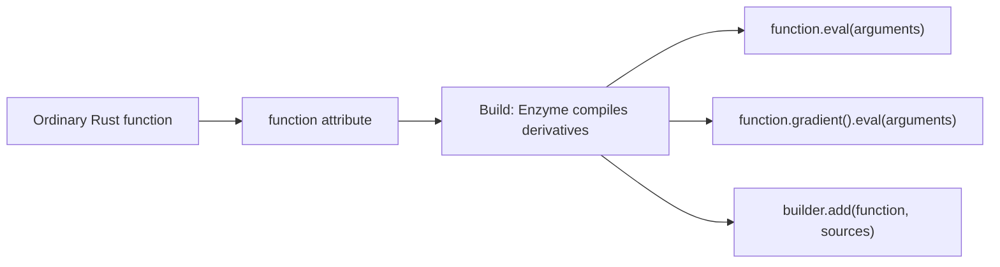
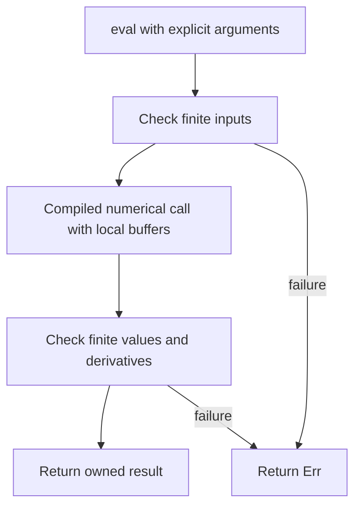

# Functions

`#[mercury::function(Rosenbrock)]` on `fn rosenbrock(x: f64, y: f64) -> f64`
preserves the ordinary Rust function and generates the named `Rosenbrock` type.
The original function is unchecked and remains callable from other numerical
functions. Start with [the complete example](../examples/rosenbrock.rs).

## Calls

For a function with `n` arguments:

| Call | Result | Work |
| --- | --- | --- |
| `Rosenbrock::new()` | Stateless function handle | No numerical evaluation |
| `function.eval(x, y)` | `Result<f64>` | Primal evaluation |
| `function.gradient()` | Stateless gradient handle | Selects an already compiled derivative |
| `gradient.eval(x, y)` | `Result<[f64; n]>` | Combined primal and reverse derivative, returns gradient |
| `function.value_and_gradient(x, y)` | `Result<(f64, [f64; n])>` | Same combined call, returns both |

For an array-returning function `fn f(x: f64, y: f64) -> [f64; m]`, `eval`
returns `Result<[f64; m]>`. Its `jacobian().eval(x, y)` returns
`Result<[[f64; n]; m]>`: `matrix[row][column] = ∂output[row]/∂argument[column]`.
This currently runs one forward derivative call per argument, each including
the primal. An array of length one still uses `jacobian()`; a scalar uses
`gradient()`.

Argument declaration order defines derivative order. Every argument is active.
The macro accepts ordinary nongeneric functions with one or more named `f64`
arguments and a return of `f64` or `[f64; N]`, where `N` is a positive integer
literal. Generics, array arguments, closures and runtime output shapes are not
part of this interface. Derivative handles expose first-order evaluation only.

## Ownership and failure

Handles hold no evaluation state and may be reused at different points. Calls
use local fixed-size arrays for Mercury's buffers and return owned results.
There is no retained point, workspace or reverse tape. Enzyme-generated code and
function bodies may allocate; this is not an allocation bound for the full call.
Separate value and gradient calls each execute the primal.

Bodies must be deterministic, have no external mutation, and be valid on their
documented domains. Checked calls return `Error::NonFinite` for NaN or infinity
in inputs, values or requested derivatives. No partial result escapes on error;
the next call is independent. Panics are not caught. Finite checks do not prove
smoothness: callers must choose points where the derivative exists. Enzyme's
behavior at singularities and branch boundaries is not a mathematical guarantee.

## Graphs and configured kernels

The named function type implements `Operator`. Pass it directly to
`builder.add(function, sources)`; a plan uses the same compiled primal, JVP and
VJP entry points. Each plan workspace owns its mutable scratch. The
[composition example](../examples/composition.rs) connects two typed functions;
the [implicit solve](../examples/implicit_solve.rs) uses one as its residual.

Use `#[differentiable(inputs = n, outputs = m)]` for inactive configuration,
runtime-sized slices or explicit domain validation. That interface and existing
plans remain supported. Plan linearizations provide reusable scratch, derivative
products and batches; their lifetime contracts are unchanged.
